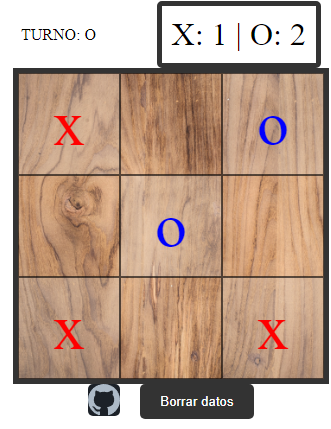
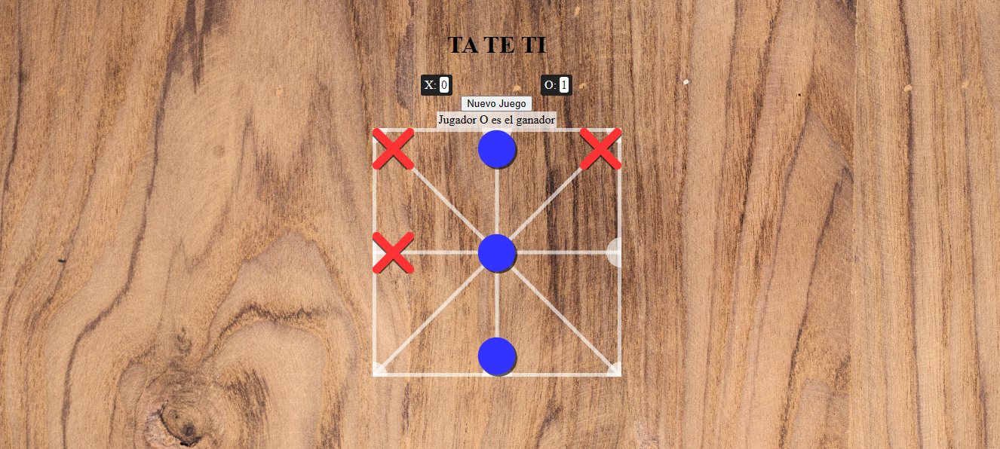

# Tateti
Juego simple de tateti hecho con html, css y js.

[Tateti 1](https://montexbjeliseo.github.io/tateti_js/)

Click y colocar fichas por turno, gana quién logre alinear en linea recta o diagonal tres de sus fichas. Sin no quedan casilleros libres se declara empate.

[Tateti 2](https://montexbjeliseo.github.io/tateti_js/tateti.html)

Hay tres fichas para cada jugador, se arrastra al tablero por turno, empieza el juego cuando todas las fichas estén dentro.

Si hay alguien hace tateti justo cuando está ingresando sus fichas al tablero (de entrada) gana el contrincante.

